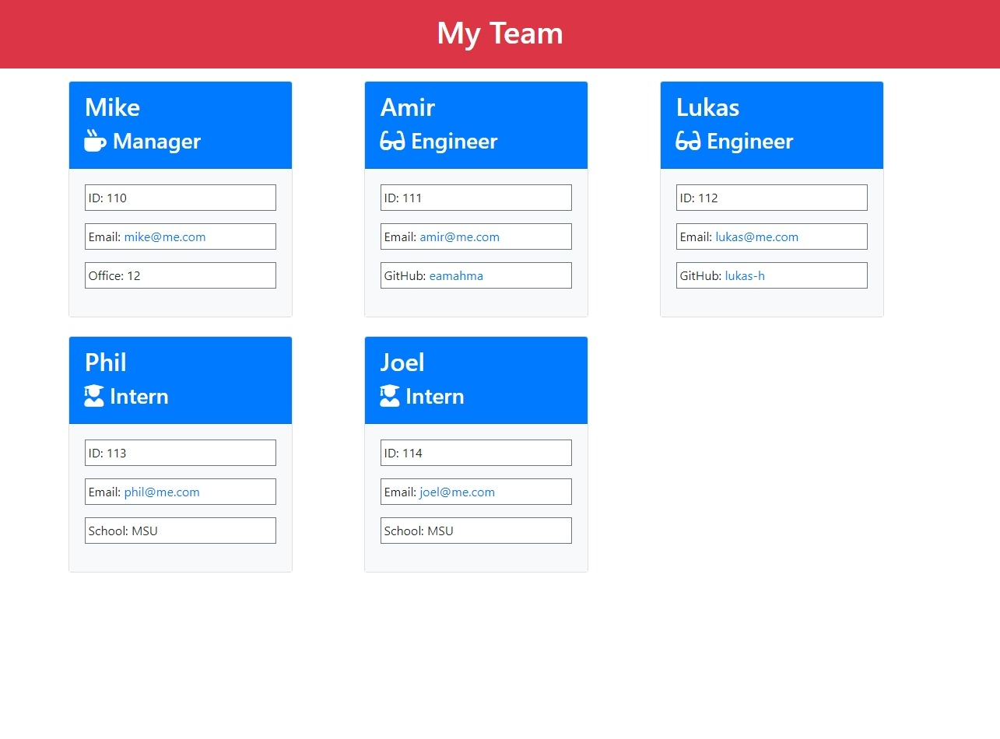

# Team Profile Generator

## Task

The task was to build a Node.js command-line application that takes in information about employees on a software engineering team, then generates an HTML webpage that displays summaries for each person.

## User Story

```md
AS A manager
I WANT to generate a webpage that displays my team's basic info
SO THAT I have quick access to their emails and GitHub profiles
```

## Acceptance Criteria

```md
GIVEN a command-line application that accepts user input
WHEN I am prompted for my team members and their information
THEN an HTML file is generated that displays a nicely formatted team roster based on user input
WHEN I click on an email address in the HTML
THEN my default email program opens and populates the TO field of the email with the address
WHEN I click on the GitHub username
THEN that GitHub profile opens in a new tab
WHEN I start the application
THEN I am prompted to enter the team manager’s name, employee ID, email address, and office number
WHEN I enter the team manager’s name, employee ID, email address, and office number
THEN I am presented with a menu with the option to add an engineer or an intern or to finish building my team
WHEN I select the engineer option
THEN I am prompted to enter the engineer’s name, ID, email, and GitHub username, and I am taken back to the menu
WHEN I select the intern option
THEN I am prompted to enter the intern’s name, ID, email, and school, and I am taken back to the menu
WHEN I decide to finish building my team
THEN I exit the application, and the HTML is generated
```

## Image

The following image shows the html created of the generated HTML’s appearance and functionality:



The styling is done using Bootstrap, Fontawsome, and Google fonts

## Video

The video in the following link shows using node.js command line and created of the generated HTML’s appearance and functionality; at the end all classes have been tests using Jest:


The styling is done using Bootstrap, Fontawsome, and Google fonts

## Running the code

```bash
node index.js
```
## Directory Structure

Directory structure follows following configuration

```md
__tests__/			// jest tests
  Employee.test.js
  Engineer.test.js
  Intern.test.js
  Manager.test.js
dist/               // rendered output (HTML) and CSS style sheet
lib/				// classes
src/				// template helper code
index.js			// runs the application
```
## Link to Github repository
[Github page for Team Profile Generator](https://github.com/eamahma/Team-Profile-Generator)